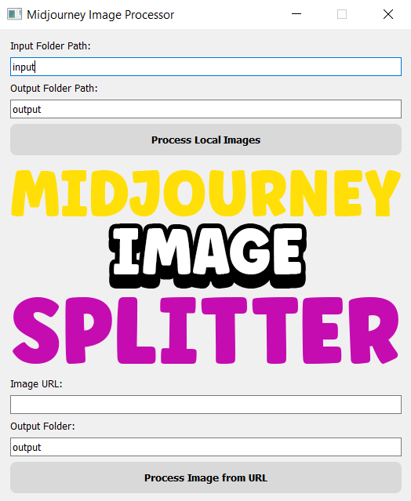
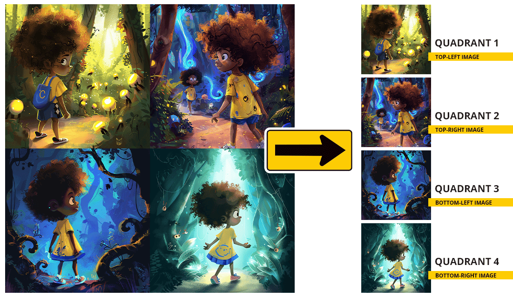

## Overview

Midjourney Image Splitter is a Python application designed to split images into quadrants. It offers both a command-line interface and a graphical user interface (GUI) built with PyQt5. Users can process images from local directories or directly from URLs.

## Features

- Split images into four quadrants
- Process images from local folders
- Fetch and split images from URLs
- Simple and intuitive GUI

## Installation

### Requirements

- Python 3.7+
- `requests` library
- `Pillow` library
- `PyQt5` library

### Installation Steps

1. Clone the repository:

    ```bash
    git clone https://github.com/Nafi7393/Midjourney-Image-Splitter.git
    cd Midjourney-Image-Splitter
    ```

2. Install the dependencies:

    ```bash
    pip install -r requirements.txt
    ```

## Usage

### Command Line

To process images in a folder:

```bash
python main.py
```

This will process images in the `input` folder and save the quadrants in the `output` folder.

### GUI

To start the GUI, run:

```bash
python gui.py
```

#### GUI Overview



1. **Local Image Processing:**
    - Enter the path to the input folder.
    - Enter the path to the output folder.
    - Click on "Process Local Images" to split all images in the input folder.

2. **URL Image Processing:**
    - Enter the URL of the image.
    - Enter the path to the output folder.
    - Click on "Process Image from URL" to fetch and split the image.

## Example




## Contributing

1. Fork the repository.
2. Create your feature branch: `git checkout -b feature/my-feature`
3. Commit your changes: `git commit -m 'Add some feature'`
4. Push to the branch: `git push origin feature/my-feature`
5. Open a pull request.

## Acknowledgements

- PyQt5 Documentation
- Pillow Documentation

For any questions or issues, please open an issue on the GitHub repository

